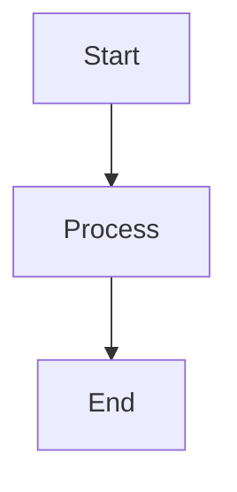

# VisProbe Documentation

Welcome to the VisProbe documentation! This README explains the documentation structure and how to build and deploy it.

## 📁 Documentation Structure

```
docs/
├── index.md                  # Main landing page
├── architecture.md           # System architecture with diagrams
├── user-guide.md            # Complete user guide with examples
├── design-rationale.md      # Design decisions and rationale
├── deployment-guide.md      # How to deploy to GitHub Pages
├── api/
│   └── index.md            # API reference
├── examples/
│   └── index.md            # Code examples
└── diagrams/               # Architecture diagrams (if needed)

mkdocs.yml                   # MkDocs configuration
```

## 🚀 Quick Start

### 1. Install Dependencies

```bash
pip install mkdocs-material pymdown-extensions mkdocs-mermaid2-plugin
```

### 2. Preview Locally

```bash
# From the VisProbe root directory
mkdocs serve
```

Open your browser to http://127.0.0.1:8000

### 3. Deploy to GitHub Pages

```bash
# Build and deploy in one command
mkdocs gh-deploy
```

Your documentation will be live at `https://yourusername.github.io/visprobe`

## 📚 Documentation Contents

### index.md - Main Overview
- Quick introduction to VisProbe
- Key features and benefits
- Installation instructions
- Quick example
- Links to detailed documentation

### architecture.md - System Architecture
- High-level architecture diagram
- Module organization
- Data flow diagrams
- Design patterns used
- Performance considerations
- Future improvements

**Includes Mermaid diagrams showing:**
- Component relationships
- Data flow through the system
- Search algorithm flowcharts

### user-guide.md - Complete User Guide
Comprehensive guide covering:
- Installation
- Quick start
- Core concepts
- Writing tests (@given and @search)
- Perturbation strategies (natural and adversarial)
- Robustness properties
- Search modes (adaptive, binary, grid, random)
- Visualization with dashboard
- Advanced usage
- Best practices
- Troubleshooting

### design-rationale.md - Design Decisions
Explains the "why" behind:
- Declarative API (decorators)
- Property design
- Strategy pattern
- Search algorithms
- Report structure
- Threading model
- Performance optimizations
- Error handling philosophy
- Alternative approaches considered

### api/index.md - API Reference
Complete API documentation:
- All decorators (@model, @data_source, @given, @search)
- Strategies (image and adversarial)
- Properties
- Report structure
- Utility functions
- Environment variables
- Type hints
- Thread safety

### examples/index.md - Code Examples
10+ complete, runnable examples:
- Basic noise testing
- Threshold finding
- CIFAR-10 integration
- Adversarial attacks
- Top-K stability
- Composite perturbations
- Intermediate layer analysis
- Batch reduction
- Custom properties
- Custom strategies
- Real-world scenarios (autonomous driving)

### deployment-guide.md - Deployment Instructions
Three deployment methods:
1. Manual deployment with MkDocs
2. Automated deployment with GitHub Actions
3. Custom domain setup

Plus:
- ReadTheDocs integration
- Troubleshooting common issues
- Customization options

## 🎨 Features

### Material Theme
- Professional, modern design
- Light and dark mode
- Responsive (mobile-friendly)
- Search functionality
- Code highlighting
- Copy-to-clipboard for code blocks

### Mermaid Diagrams
- Architecture diagrams
- Flow charts
- Sequence diagrams
- Component relationships

### Enhanced Markdown
- Admonitions (notes, warnings, tips)
- Tabbed content
- Code annotations
- Math equations support
- Task lists

## 🔧 Customization

### Change Colors

Edit `mkdocs.yml`:

```yaml
theme:
  palette:
    primary: blue  # indigo, blue, red, green, purple, etc.
    accent: blue
```

### Add Your Branding

1. Update site information in `mkdocs.yml`:
```yaml
site_name: VisProbe Documentation
site_author: Bilge Demirkaya
repo_url: https://github.com/yourname/visprobe
```

2. Add logo (optional):
```yaml
theme:
  logo: assets/logo.png
```

### Add Custom CSS

1. Create `docs/stylesheets/extra.css`
2. Reference in `mkdocs.yml`:
```yaml
extra_css:
  - stylesheets/extra.css
```

### Add Google Analytics

```yaml
extra:
  analytics:
    provider: google
    property: G-XXXXXXXXXX
```

## 📊 Diagrams

### Mermaid Diagrams
Used throughout the documentation for visual explanations:

- **High-level architecture** - Component relationships
- **Data flow** - How data moves through the system
- **Search algorithms** - Flowcharts for each search mode
- **Sequence diagrams** - Test execution flow

All diagrams are defined inline using Mermaid syntax and render automatically.

## 🚢 Deployment Options

### Option 1: GitHub Pages (Recommended)
```bash
mkdocs gh-deploy
```
**Result:** https://yourusername.github.io/visprobe

### Option 2: GitHub Actions (Automated)
Create `.github/workflows/docs.yml` and push to GitHub.
**Result:** Auto-deploy on every commit to main

### Option 3: ReadTheDocs
Connect your repository to ReadTheDocs.
**Result:** https://visprobe.readthedocs.io

### Option 4: Custom Domain
Add `CNAME` file and configure DNS.
**Result:** https://docs.yourproject.com

## 📝 Updating Documentation

### Adding New Pages

1. Create markdown file in `docs/`
2. Add to navigation in `mkdocs.yml`:

```yaml
nav:
  - Home: index.md
  - Your New Page: new-page.md
```

### Adding New Examples

Add code examples to `docs/examples/index.md` or create separate files:

```
docs/examples/
├── index.md
├── basic-usage.md
├── advanced-patterns.md
└── real-world-scenarios.md
```

Update navigation:
```yaml
nav:
  - Examples:
      - Overview: examples/index.md
      - Basic Usage: examples/basic-usage.md
      - Advanced: examples/advanced-patterns.md
```

### Adding Diagrams

Use Mermaid syntax directly in markdown:

````markdown

````

## 🧪 Testing Documentation

### Check for Broken Links
```bash
mkdocs build --strict
```

### Validate Markdown
```bash
pip install markdownlint-cli
markdownlint docs/
```

### Test Locally
```bash
mkdocs serve
# Visit http://127.0.0.1:8000
```

## 📦 Building for Distribution

### Generate Static HTML
```bash
mkdocs build
# Output in site/ directory
```

### Generate PDF (requires plugin)
```bash
pip install mkdocs-pdf-export-plugin
mkdocs build
```

## 🤝 Contributing to Documentation

1. Fork the repository
2. Make your changes in `docs/`
3. Test locally: `mkdocs serve`
4. Submit pull request

**Documentation improvements welcome:**
- Fixing typos
- Adding examples
- Clarifying explanations
- Adding diagrams
- Improving code snippets

## 📖 Documentation Standards

### Writing Style
- **Clear and concise** - No unnecessary jargon
- **Examples first** - Show, then explain
- **Progressive disclosure** - Simple concepts first
- **Action-oriented** - Use imperative verbs

### Code Examples
- **Complete** - Runnable as-is
- **Commented** - Explain non-obvious parts
- **Realistic** - Based on real use cases
- **Tested** - Verify examples work

### Diagrams
- **Simple** - Not too complex
- **Focused** - One concept per diagram
- **Labeled** - Clear component names
- **Consistent** - Same style throughout

## 🔍 Search Optimization

Documentation includes full-text search powered by MkDocs.

To improve search results:
1. Use descriptive headings
2. Include keywords in first paragraph
3. Use code block titles
4. Add metadata to pages

## 📱 Mobile Responsiveness

Documentation is fully responsive:
- Readable on phones and tablets
- Touch-friendly navigation
- Optimized images
- Responsive tables

## 🌐 Internationalization

To add translations:

1. Create language-specific directories:
```
docs/
├── en/
│   └── index.md
└── es/
    └── index.md
```

2. Configure in `mkdocs.yml`:
```yaml
plugins:
  - i18n:
      default_language: en
      languages:
        en: English
        es: Español
```

## 🎯 Next Steps

1. **Customize** - Update colors, branding, URLs in `mkdocs.yml`
2. **Test** - Run `mkdocs serve` and check all pages
3. **Deploy** - Run `mkdocs gh-deploy`
4. **Share** - Your documentation is live!

## 🆘 Need Help?

- [MkDocs Documentation](https://www.mkdocs.org/)
- [Material Theme Docs](https://squidfunk.github.io/mkdocs-material/)
- [Mermaid Diagram Syntax](https://mermaid-js.github.io/)

## 📄 License

Documentation is part of the VisProbe project and follows the same license.

---

**Ready to deploy?**

```bash
pip install mkdocs-material pymdown-extensions mkdocs-mermaid2-plugin
mkdocs serve  # Test locally
mkdocs gh-deploy  # Deploy to GitHub Pages
```

Your documentation will be live in minutes! 🎉
