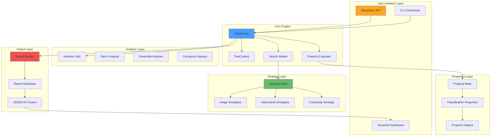
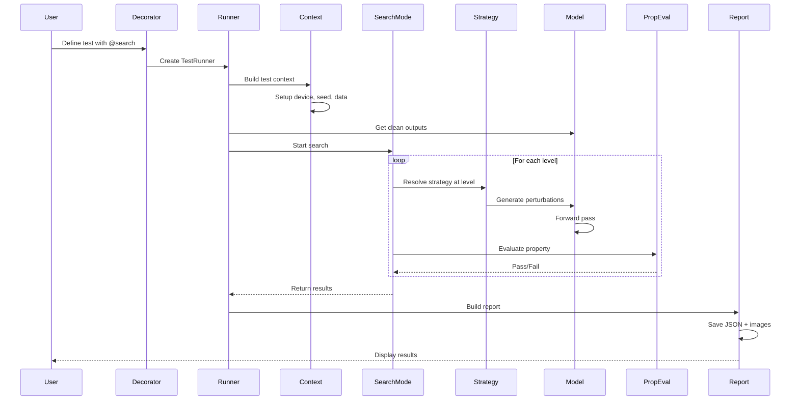

# VisProbe Architecture

This document describes the architectural design of VisProbe, explaining how different modules interact and why certain design decisions were made.

## High-Level Architecture



## Module Organization

### 1. API Layer (`visprobe/api/`)

The entry point for users, providing the decorator-based interface.

```
api/
├── decorators.py          # @model, @data_source, @given, @search
├── runner.py              # TestRunner orchestrates execution
├── context.py             # TestContext manages environment setup
├── search_modes.py        # Adaptive, binary, grid, random search
├── property_evaluator.py  # Evaluates properties on outputs
├── analysis_utils.py      # Resolution, noise, corruption analysis
├── report_builder.py      # Constructs report components
├── report.py              # Report dataclass and serialization
├── config.py              # Global configuration and device selection
├── registry.py            # Thread-safe test registration
└── utils.py               # Utility functions
```

**Design Rationale:**
- **Separation of concerns**: Each module has a single, well-defined responsibility
- **Decorator pattern**: Provides clean, declarative API without framework lock-in
- **Modular search**: Different search algorithms are isolated for easy extension

### 2. Strategy Layer (`visprobe/strategies/`)

Defines how to perturb inputs to test robustness.

```
strategies/
├── base.py               # Strategy base class and resolution
├── image.py              # Natural transformations (noise, brightness, etc.)
└── adversarial.py        # Gradient-based attacks (FGSM, PGD, etc.)
```

**Design Rationale:**
- **Strategy pattern**: Encapsulates perturbation algorithms
- **Uniform interface**: All strategies implement `generate(imgs, model, level)`
- **Composability**: CompositeStrategy allows chaining perturbations
- **Lazy imports**: ART dependency is optional via lazy loading

### 3. Properties Layer (`visprobe/properties/`)

Defines what robustness means for your task.

```
properties/
├── base.py               # Property base class
├── classification.py     # Classification-specific properties
└── helpers.py            # Utility functions for properties
```

**Design Rationale:**
- **Property pattern**: Each property is a callable that returns bool
- **Task-agnostic**: Easy to extend for regression, generation, etc.
- **Composable**: Properties can be combined with boolean logic

### 4. CLI Layer (`visprobe/cli/`)

Command-line interface and visualization.

```
cli/
├── cli.py                # Main CLI entry point
├── dashboard.py          # Streamlit dashboard
├── dashboard_helpers.py  # Dashboard utility functions
└── utils.py              # CLI utilities
```

**Design Rationale:**
- **Security first**: Input validation to prevent command injection
- **Progressive disclosure**: Auto-run tests if results don't exist
- **Separation**: CLI and library are decoupled

## Data Flow

### 1. Test Execution Flow



### 2. Search Algorithm Flow

```mermaid
graph TD
    Start[Start Search] --> GetClean[Get Clean Outputs]
    GetClean --> ChooseMode{Search Mode?}

    ChooseMode -->|Adaptive| AdaptInit[Init level, step]
    ChooseMode -->|Binary| BinInit[Init lo=0, hi=max]
    ChooseMode -->|Grid| GridInit[Create level grid]
    ChooseMode -->|Random| RandInit[Sample random levels]

    AdaptInit --> AdaptLoop{Pass?}
    AdaptLoop -->|Yes| AdaptInc[level += step]
    AdaptLoop -->|No| AdaptDec[level -= step, step /= 2]
    AdaptInc --> AdaptCheck{step > min_step?}
    AdaptDec --> AdaptCheck
    AdaptCheck -->|Yes| AdaptEval[Evaluate at level]
    AdaptEval --> AdaptLoop
    AdaptCheck -->|No| Done[Return failure threshold]

    BinInit --> BinLoop{Pass?}
    BinLoop -->|Yes| BinHigh[lo = mid]
    BinLoop -->|No| BinLow[hi = mid]
    BinHigh --> BinCheck{hi - lo > min_step?}
    BinLow --> BinCheck
    BinCheck -->|Yes| BinMid[mid = (lo + hi) / 2]
    BinMid --> BinEval[Evaluate at mid]
    BinEval --> BinLoop
    BinCheck -->|No| Done

    GridInit --> GridLoop[For each level]
    GridLoop --> GridEval[Evaluate]
    GridEval --> GridPass{Pass?}
    GridPass -->|No| Done
    GridPass -->|Yes| GridNext{More levels?}
    GridNext -->|Yes| GridLoop
    GridNext -->|No| Done

    RandInit --> RandLoop[For each sample]
    RandLoop --> RandEval[Evaluate]
    RandEval --> RandNext{More samples?}
    RandNext -->|Yes| RandLoop
    RandNext -->|No| RandMin[Return min failure]
    RandMin --> Done

    Done --> BuildReport[Build Report]
    BuildReport --> SaveResults[Save JSON + Images]

    style AdaptLoop fill:#4a9eff
    style BinLoop fill:#66bb6a
    style GridLoop fill:#f9a825
    style RandLoop fill:#ef5350
```

## Key Design Patterns

### 1. Strategy Pattern (Perturbations)

**Why**: Allows users to plug in custom perturbation methods without modifying core code.

```python
class Strategy:
    def generate(self, imgs, model, level=None):
        raise NotImplementedError
```

**Benefits**:
- Open-closed principle: open for extension, closed for modification
- Testable: each strategy can be unit tested independently
- Composable: strategies can be chained

### 2. Decorator Pattern (API)

**Why**: Provides declarative, readable test definitions without framework lock-in.

```python
@model(my_model)
@data_source(data)
@search(strategy=...)
def test_robustness(original, perturbed):
    return property_holds(original, perturbed)
```

**Benefits**:
- Separation of configuration from logic
- Familiar Python idiom
- No base classes or framework coupling

### 3. Context Manager (Query Counting)

**Why**: Safely track model queries without monkey-patching.

```python
with QueryCounter(model) as qc:
    output = model(input)
queries_used = qc.extra
```

**Benefits**:
- Thread-safe using hooks
- Automatic cleanup
- No global state pollution

### 4. Builder Pattern (Reports)

**Why**: Complex report construction with many optional fields.

```python
report = Report(
    test_name="...",
    test_type="search",
    original_image=...,
    perturbed_image=...,
    # ... many more fields
)
```

**Benefits**:
- Gradual construction
- Type safety with dataclasses
- Easy serialization

### 5. Registry Pattern (Test Discovery)

**Why**: Allow decorators to register tests for CLI discovery.

```python
class TestRegistry:
    @classmethod
    def register_search(cls, test):
        cls.get_search_tests().append(test)
```

**Benefits**:
- Thread-local storage for parallelism
- Automatic test discovery
- No global shared state

## Threading and Concurrency

### Thread Safety

VisProbe is designed to be thread-safe:

1. **TestRegistry**: Uses thread-local storage for test registration
2. **QueryCounter**: Uses PyTorch hooks (thread-safe)
3. **Random seeds**: Each test gets its own Generator instance
4. **Strategy caching**: Uses instance-level caches keyed by device/model ID

### Device Management

```python
def get_default_device():
    # Priority:
    # 1. Explicit VISPROBE_DEVICE env var
    # 2. Auto-detect with VISPROBE_PREFER_GPU
    # 3. Default to CPU for stability
```

**Why CPU default?**
- Maximum compatibility across environments
- Avoids GPU OOM on large models
- Users can opt-in to GPU via environment variables

## Error Handling Philosophy

### 1. Fail Fast on Configuration Errors

Validate parameters at decoration time:
```python
if k < 1:
    raise ValueError("k must be >= 1")
```

### 2. Graceful Degradation on Analysis Failures

Analysis features (ensemble, corruption sweeps) return `None` on failure:
```python
try:
    return run_corruption_sweep(...)
except Exception:
    return None  # Don't break the entire test
```

### 3. Informative Error Messages

```python
raise ImportError(
    "Adversarial strategies require ART. "
    "Install with: pip install adversarial-robustness-toolbox\n"
    f"Original error: {e}"
)
```

## Performance Considerations

### 1. Lazy Imports

```python
# Only import ART when adversarial strategies are used
try:
    from art.attacks.evasion import FastGradientMethod
    _ART_AVAILABLE = True
except ImportError:
    _ART_AVAILABLE = False
```

### 2. Tensor Caching

```python
# Cache normalized mean/std tensors per device
self._stats_cache: Dict[torch.device, Tuple[Tensor, Tensor]] = {}
```

### 3. Query Counting Overhead

Uses PyTorch hooks instead of monkey-patching:
- Minimal overhead (~1% for typical models)
- No global state modification
- Thread-safe

### 4. Search Efficiency

Binary search is O(log n) vs O(n) for grid:
```python
# Binary search: ~10 queries for 1024-level space
# Grid search: 1024 queries
```

## Extensibility Points

### 1. Custom Strategies

```python
class MyStrategy(Strategy):
    def generate(self, imgs, model, level=None):
        # Your perturbation logic
        return perturbed_imgs
```

### 2. Custom Properties

```python
class MyProperty(Property):
    def __call__(self, original, perturbed):
        # Your robustness criterion
        return is_robust
```

### 3. Custom Search Modes

Add to `search_modes.py`:
```python
def perform_my_search(runner, params, clean_results):
    # Your search algorithm
    return {"failure_threshold": ..., "path": [...]}
```

### 4. Custom Analysis

Add to `analysis_utils.py`:
```python
def run_my_analysis(runner, ...):
    # Your analysis logic
    return analysis_results
```

## Testing Strategy

### Unit Tests
- Each module has focused unit tests
- Mock dependencies for isolation
- Test edge cases and error paths

### Integration Tests
- End-to-end decorator usage
- Multiple strategies and properties
- Report generation and serialization

### Property-Based Testing
- Use Hypothesis for property tests
- Verify search always finds thresholds
- Check report serialization roundtrips

## Future Architecture Improvements

1. **Plugin System**: Allow third-party strategy/property packages
2. **Parallel Search**: Multi-GPU distribution of search queries
3. **Caching Layer**: Cache perturbations across similar tests
4. **Streaming Reports**: Real-time dashboard updates during search
5. **Distributed Testing**: Support for model servers / remote inference
